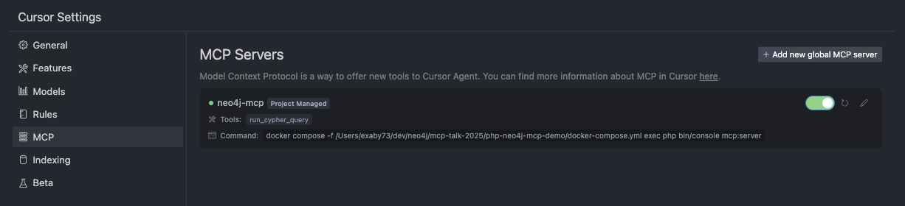

# Neo4j MCP Server Demo

A demonstration of a Model Context Protocol (MCP) server that provides seamless integration between AI assistants and Neo4j graph databases. This project showcases how to build and deploy an MCP server using PHP and Symfony, enabling AI models to interact with graph data through natural language queries.

Built by [Nagels](https://nagels.tech)

## What is MCP?

The Model Context Protocol (MCP) is an open standard that enables AI assistants to securely connect to external data sources and tools. This Neo4j MCP server allows AI models to:

- Execute Cypher queries against Neo4j databases
- Retrieve graph data and relationships
- Perform complex graph analytics
- Interact with graph databases through natural language

## Features

- **Cypher Query Execution**: Run arbitrary Cypher queries against your Neo4j database
- **Secure Connection**: Built-in authentication and connection management
- **Docker-based**: Easy deployment with Docker Compose
- **MCP Compatible**: Works with any MCP client (Cursor, Claude Desktop, VS Code, etc.)
- **Symfony Framework**: Built on the robust Symfony console framework

## Prerequisites

- **Docker**: Ensure Docker is installed and running on your system
- **MCP Client**: Cursor, Claude Desktop, VS Code preview, or any other MCP-compatible client

## Setup Instructions

### 1. Configure MCP Client (Cursor Example)

Edit your `.cursor/mcp.json` file to configure the Neo4j MCP server:

```json
{
  "mcpServers": {
    "neo4j-mcp": {
      "command": "docker",
      "args": [
        "compose",
        "-f",
        "/path/to/your/project/docker-compose.yml",
        "exec",
        "php",
        "bin/console",
        "mcp:server"
      ]
    }
  }
}
```

**Important Note**: Replace `/path/to/your/project/docker-compose.yml` with the absolute path to your project's `docker-compose.yml` file. Cursor runs MCP servers from `/` as the working directory, so we need to explicitly pass the path to our docker compose file. In a production MCP server, this would typically be installed as a CLI tool (like Symfony) or a composer command.

### 2. Start the Services

Ensure Docker is running, then build and start the containers:

```bash
docker compose up --build
```

This will start:

- **Neo4j database** on ports 7474 (browser) and 7687 (bolt)
- **PHP container** with the MCP server ready to run

### 3. Install Dependencies

In a new terminal, install the PHP dependencies:

```bash
docker compose exec php composer install
```

### 4. Configure Your MCP Client

#### For Cursor:

1. Go to **Cursor Settings** → **MCP**
2. Find the `neo4j-mcp` server in the list
3. Click the **reload button** until the status dot turns **green**



#### For Other MCP Clients:

- **Claude Desktop**: Add the server configuration to your `claude_desktop_config.json`
- **VS Code**: VS Code preview has support for MCP - add the server configuration
- **Other clients**: Follow the client-specific MCP server configuration instructions

## Usage

Once the MCP server is running and connected to your client, you can interact with your Neo4j database through natural language. The AI assistant will be able to:

- Execute Cypher queries
- Retrieve node and relationship data
- Perform graph analytics
- Answer questions about your graph data

Example interactions:

- "Show me all nodes in the database"
- "Find relationships between users and products"
- "Execute this Cypher query: MATCH (n) RETURN count(n)"

## Database Access

- **Neo4j Browser**: http://localhost:7474
- **Username**: `neo4j`
- **Password**: `password`
- **Bolt URL**: `bolt://localhost:7687`

## Project Structure

```
├── src/
│   ├── Command/
│   │   └── McpServerCommand.php    # Main MCP server implementation
│   └── ...
├── docker-compose.yml              # Docker services configuration
├── Dockerfile                      # PHP container setup
├── composer.json                   # PHP dependencies
└── .cursor/
    └── mcp.json                    # Cursor MCP configuration
```

## Troubleshooting

### MCP Server Not Connecting

1. Ensure Docker containers are running: `docker compose ps`
2. Check if dependencies are installed: `docker compose exec php composer install`
3. Verify the path in your MCP configuration is absolute and correct
4. Reload the MCP server in your client settings

### Neo4j Connection Issues

1. Wait for Neo4j to fully start (health check should pass)
2. Check Neo4j logs: `docker compose logs neo4j`
3. Verify Neo4j is accessible at http://localhost:7474

### Docker Issues

1. Ensure Docker is running
2. Try rebuilding containers: `docker compose up --build --force-recreate`
3. Check for port conflicts (7474, 7687)

## Development

To modify the MCP server:

1. Edit files in the `src/` directory
2. The container automatically mounts the current directory
3. Restart the MCP server in your client to pick up changes
